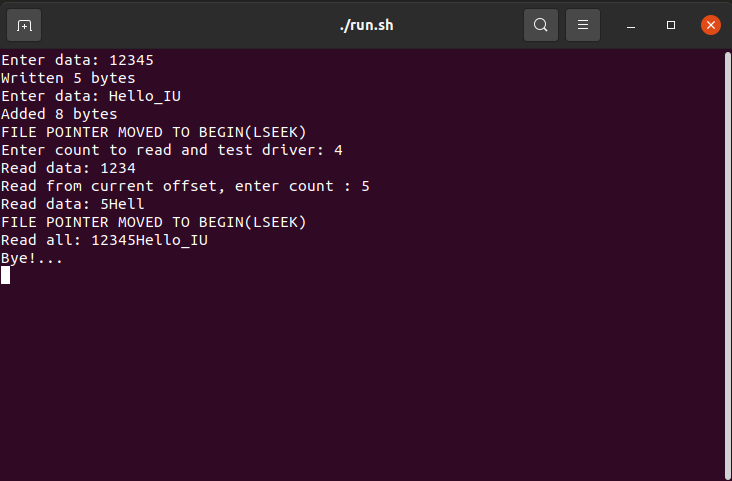

# Char device Linux driver.

## Description.

Linux kernel module for symbolic devices (count can be defined in mychardev.c). 

To make, insmod and test module write ***./run.sh*** command, you will see an inteface for testing.
To clean all beside sourse files make target clean (***make clean***). 

## Instruction.
Read command reads from ***current offset***, you can change offset without closing, use ***lseek***. 

Write command writes to ***current offset***, writting to the opened file will add data, not rewritting, to rewrite close file or use ***lseek*** function. 

## Testing program example:

- *Firstly opened file and writed 5 symbols*
- *Then without closing added 8 symbols (to current offset)*
- *To read from begin wihtout reopening use lseek*
- *Read 4 symbols from begin*
- *Then read 5 from current offset*
- *Move offset to begin and read all*
- *As we see driver works correctly(as author expected)*

## Kernel log

