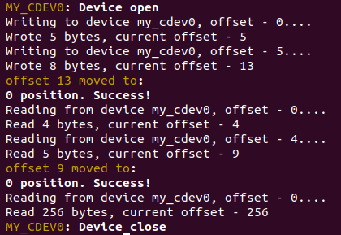

# Char_device_driver
Linux kernel module for symbolic devices (count can be defined in mychardev.c)

To make, insmod and test module write ./run.sh command, you will see an inteface for testing.

### Write command writes from current offset, writting to the opened file will add data, not rewritting, to rewrite close file

## Write to file

## Read specific number of bytes

 
## Read all that file contains till the end

